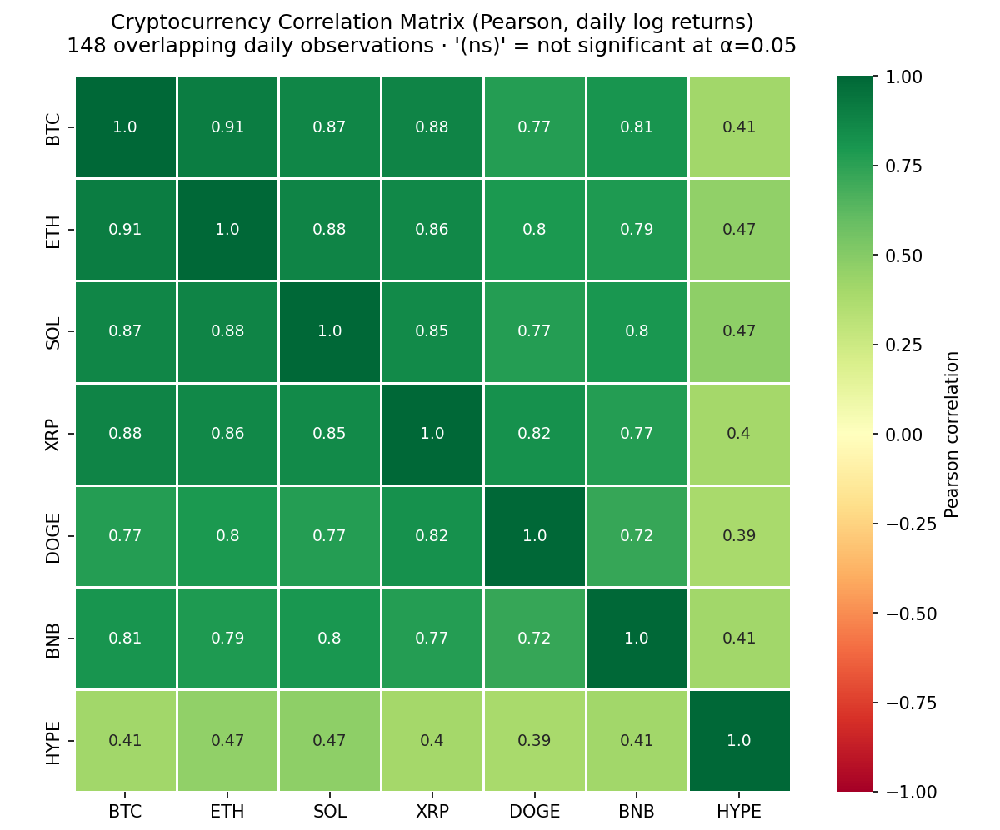

# Crypto Correlation Matrix

A statistically rigorous cryptocurrency correlation analysis tool. It fetches real daily price data from free public APIs (no API keys required), computes correlations on **log returns** (not raw prices), and backs every number with **hypothesis tests, p-values, and confidence intervals** — so you can tell real relationships from noise.



## Why this tool is different

Most "crypto correlation" scripts correlate raw prices. That is statistically wrong: prices are non-stationary, and correlating them produces spurious, inflated results. This tool:

- Computes correlations on **daily log returns**, the standard approach in quantitative finance.
- Reports a **p-value for every pair** (test of H₀: ρ = 0) and a **95% confidence interval** via the Fisher z-transformation.
- Applies a **Bonferroni correction** for multiple comparisons across all pairs.
- Supports **Pearson, Spearman, and Kendall** — crypto returns are heavy-tailed, so rank-based methods are often more robust.
- Runs a **Jarque–Bera normality test** per asset so you know when Pearson assumptions are shaky.
- Computes **rolling correlations** (e.g., 30-day vs. BTC) to reveal regime changes a single number would hide.
- Marks non-significant coefficients directly on the heatmap with `(ns)`.

## Data sources (free, no key needed)

For each asset the tool tries these sources in order, with automatic fallback:

1. **Binance public API** — daily klines (`SYMBOL/USDT`)
2. **CoinGecko free API** — daily market chart in USD
3. **CryptoCompare free API** — daily OHLC in USD

All series are aligned on shared dates so every pairwise correlation uses the exact same sample.

## Installation

```bash
git clone https://github.com/<your-username>/crypto-correlation-matrix.git
cd crypto-correlation-matrix
pip install -r requirements.txt
```

Requires Python 3.10+.

## Usage

Default run (BTC, ETH, SOL, XRP, DOGE, BNB, HYPE over the last 365 days):

```bash
python -m crypto_correlation
```

Custom run:

```bash
python -m crypto_correlation \
  --symbols BTC ETH SOL XRP DOGE BNB HYPE ADA LINK \
  --days 365 \
  --method spearman \
  --rolling-window 30 \
  --benchmark BTC \
  --output-dir output
```

### Options

| Flag | Default | Description |
|------|---------|-------------|
| `--symbols` | `BTC ETH SOL XRP DOGE BNB HYPE` | Tickers to analyze |
| `--days` | `365` | Daily observations to fetch |
| `--method` | `pearson` | `pearson`, `spearman`, or `kendall` |
| `--rolling-window` | `30` | Window (days) for rolling correlation |
| `--benchmark` | `BTC` | Asset used for the rolling chart |
| `--output-dir` | `output` | Where CSVs and charts are written |
| `--alpha` | `0.05` | Significance level |
| `-v` | off | Verbose logging (shows which API served each asset) |

### Output files

- `correlation_heatmap.png` — annotated heatmap with significance flags
- `rolling_correlation.png` — rolling correlation vs. the benchmark
- `correlation_<method>.csv`, `pvalues_<method>.csv` — full matrices
- `pairwise_summary.csv` — one row per pair: coefficient, p-value, 95% CI, Bonferroni flag
- `descriptive_stats.csv` — annualized return/volatility, skew, kurtosis, normality test
- `prices.csv`, `log_returns.csv` — the raw aligned data for reproducibility

### Using it as a library

```python
from crypto_correlation import fetch_prices, compute_returns, correlation_with_pvalues

prices, sources = fetch_prices(["BTC", "ETH", "SOL"], days=180)
returns = compute_returns(prices)
corr, pvals, summary = correlation_with_pvalues(returns, method="spearman")
print(summary)
```

## Running the tests

The statistical engine is fully unit-tested against SciPy reference values and synthetic data with known correlation structure:

```bash
pip install pytest
pytest tests/ -v
```

## Interpreting results

- **|r| > 0.7** — strong co-movement (common between BTC/ETH and large caps).
- **p-value** — probability of seeing a correlation this large if the true correlation were zero. Small p (< 0.05) → likely real.
- **`(ns)` on the heatmap** — not statistically significant; treat that number as noise.
- **Rolling chart** — crypto correlations are regime-dependent; they spike toward 1 in market-wide crashes and drift apart in calm periods.

## Disclaimer

This tool is for educational and research purposes only. Correlation is not causation, past correlation does not guarantee future co-movement, and nothing here is financial advice.

## License

MIT — see [LICENSE](LICENSE).
